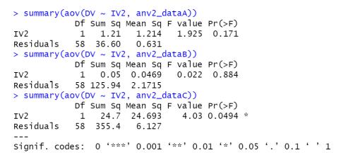

Assignment_4
================
Jaimie Chin
2023-04-18

``` r
# Load packages 
library(tidyverse)
```

# Question 1

A researcher wants to know which strategies can help people build
effective habits. Here, they specifically looked at the number of days
people completed the CDC guidelines of moving at least 30 minutes a day.
The researcher had participants mark the number of days they completed
this, where 0 means they did it 0 days and 7 means they did it every day
of the week. Participants were assigned to one of 4 groups.

- Participants in Group A were in the control group.
- Participants in Group B were instructed to put a sticker on their
  calendar for every day they met their daily exercise goal.
- Participants in Group C were instructed to tell a close friend or
  family member that they were trying to build the habit of exercising
  daily.
- Participants in Group D were instructed to save a dollar in a jar for
  each day they exercised and then at the end of the week, use the money
  they earned” to treat themselves to something.

The researcher wants to compare the number of days people in each of
these 4 groups exercised. Import the data into RStudio. I recommend
using the graphic interface to import data. File \> Import Dataset \>
From text (readr or baser)

Run a one-way ANOVA in R.

``` r
# Load the dataset from .csv 
filepath = 'data/data_assignment4_q1.csv'
df_1 = read_csv(filepath, show_col_types = FALSE)
df_1
```

    ## # A tibble: 200 × 2
    ##    group    DV
    ##    <chr> <dbl>
    ##  1 A         2
    ##  2 A         1
    ##  3 A         3
    ##  4 A         2
    ##  5 A         2
    ##  6 A         1
    ##  7 A         1
    ##  8 A         1
    ##  9 A         2
    ## 10 A         1
    ## # … with 190 more rows

``` r
# Run a one way ANOVA of the dataset 
res.aov = aov(DV ~ group, data = df_1)
summary(res.aov)
```

    ##              Df Sum Sq Mean Sq F value   Pr(>F)    
    ## group         3    171   57.01   24.13 2.46e-13 ***
    ## Residuals   196    463    2.36                     
    ## ---
    ## Signif. codes:  0 '***' 0.001 '**' 0.01 '*' 0.05 '.' 0.1 ' ' 1

## 1. What is the F value for the ANOVA? (1 pt)

The F value for the ANOVA is $24.13$.

## 2. What is the p value? Is it statistically significant? (2 pt)

The p-value is $2.46e^-13$. This value is less than the commonly used
significance level of 0.05, indicating that we can reject the null
hypothesis of equal means among all groups. Therefore, we can conclude
that the differences among the groups are statistically significant.

## 3. What are the between group and within group degrees of freedom? (2 pt)

The between group degrees of freedom is $3$, which represents the number
of groups minus 1. The within group degrees of freedom is $196$, which
is calculated as the total number of observations minus the number of
groups.

## 4. What are the total degrees of freedom (1 pt)

The total degrees of freedom is the sum of the between and within group
degrees of freedom. In this case, the total degrees of freedom is $199$,
which is equal to $3$ (between groups) + $196$ (within groups) = $199$.

## 5. What can we conclude from the omnibus ANOVA test? Write a sentence interpreting the findings given the F and p value you listed in 1 and 2. (2 pts)

Based on the results of the omnibus ANOVA test, we can conclude that
there is strong evidence against the null hypothesis of equal means
among all groups. The F-value of $24.13$ and the extremely low p-value
of $2.46e^-13$ indicate that the differences among the groups are
statistically significant at a high level of confidence. Therefore, we
can reject the null hypothesis and conclude that there are statistically
significant differences in means among the groups.

## 6. Should we run a post-hoc test? Why or why not? (2 pts)

Yes, we should run a post-hoc test. The output of the ANOVA test only
indicates that there are significant differences among the groups, but
it does not indicate which specific groups are different. Therefore, a
post-hoc test would be necessary to determine the pairwise differences
between groups and to identify which specific groups have significantly
different means.

## 7. Regardless of your response in Part 6, run a post-hoc pairwise comparison. What do the pairwise comparisons suggest? That is, what can you say about the different groups and their impact on developing regular exercise habits. Note: `emmeans()` automatically applies an adjustment for multiple comparisons, so you can interpret the p values using the typical .05 threshold. (2 pts)

``` r
# Run a TukeyHSD post-hoc test of the one-way ANOVA
TukeyHSD(res.aov)
```

    ##   Tukey multiple comparisons of means
    ##     95% family-wise confidence level
    ## 
    ## Fit: aov(formula = DV ~ group, data = df_1)
    ## 
    ## $group
    ##     diff          lwr       upr     p adj
    ## B-A 0.80  0.003449335 1.5965507 0.0485683
    ## C-A 2.12  1.323449335 2.9165507 0.0000000
    ## D-A 2.20  1.403449335 2.9965507 0.0000000
    ## C-B 1.32  0.523449335 2.1165507 0.0001610
    ## D-B 1.40  0.603449335 2.1965507 0.0000543
    ## D-C 0.08 -0.716550665 0.8765507 0.9938066

The output of the Tukey HSD post-hoc test shows the pairwise comparisons
between the four groups with respect to the number of days they
exercised. The results suggest that:

1.  Participants in Group B (who were instructed to put a sticker on
    their calendar for every day they met their daily exercise goal)
    exercised for significantly more days than those in the control
    group (Group A) with a mean difference of 0.80 and a p-value of
    $0.0486$.
2.  Participants in Group C (who were instructed to tell a close friend
    or family member that they were trying to build the habit of
    exercising daily) and Group D (who were instructed to save a dollar
    in a jar for each day they exercised and then at the end of the
    week, use the money they earned to treat themselves to something)
    exercised for significantly more days than the control group
    (Group A) with mean differences of $2.12$ and $2.20$, respectively,
    and p-values of 0.0000.
3.  Participants in Group C and Group D did not differ significantly in
    the number of days they exercised (mean difference of $0.08$,
    p-value of $0.9938$).
4.  Participants in Group B and Group C, as well as Group B and Group D,
    and Group C and Group D, all differ significantly in the number of
    days they exercised (all p-values \< $0.001$).

Based on these results, we can conclude that all three intervention
groups (B, C, and D) were effective in helping people develop a regular
exercise habit compared to the control group (A). Furthermore, the
strategies of putting a sticker on the calendar and telling a close
friend or family member were equally effective in promoting regular
exercise habits, while saving a dollar in a jar for each day of exercise
was slightly more effective.

# Question 2

A researcher is interested in how multitasking impacts the rate of
making errors. The basic task required participants to identify whether
a letter was a vowel or consonant (they pressed a button to indicate
their response). Some participants were asked to do another task at the
same time. Participants were assigned to one of three groups:

- Participants in Group A were the control group (i.e., they only
  completed the vowel/consonant task).
- Participants in Group B also heard numbers at the same time and had to
  verbally say aloud whether the number was odd or even.
- Participants in Group C heard letters at the same time, and had to
  verbally say aloud whether the letters were a vowel or a consonant (in
  addition to identifying the type of letter on the screen).

Participants were also assigned to either a “short” or “long” task
group. Participants in the short task group completed 50 trials.
Participants in the long task group completed 200 trials.

The dependent variable captures the number of errors participants made
(per 50 trials). So a 6 indicates that for every 50 trials, a
participant made roughly 6 errors on the button press task.

Import the data into RStudio. I recommend using the graphic interface to
import data. File \> Import Dataset \> From text (readr or baser)

Run a two-way ANOVA in R.

``` r
filepath = 'data/data_assignment4_q2.csv'
df_2 = read_csv(filepath, show_col_types = FALSE)
df_2
```

    ## # A tibble: 180 × 3
    ##    IV1   IV2      DV
    ##    <chr> <chr> <dbl>
    ##  1 A     short 2.19 
    ##  2 A     short 1.24 
    ##  3 A     short 0.461
    ##  4 A     short 0.396
    ##  5 A     short 2.00 
    ##  6 A     short 1.34 
    ##  7 A     short 0.631
    ##  8 A     short 1.04 
    ##  9 A     short 2.60 
    ## 10 A     short 2.96 
    ## # … with 170 more rows

``` r
# Run a two-way ANOVA of the dataset 
res.taov = aov(DV ~ IV1 * IV2, data=df_2)
summary(res.taov)
```

    ##              Df Sum Sq Mean Sq F value Pr(>F)    
    ## IV1           2  536.7  268.33  90.148 <2e-16 ***
    ## IV2           1    5.6    5.56   1.868 0.1735    
    ## IV1:IV2       2   20.4   10.20   3.426 0.0347 *  
    ## Residuals   174  517.9    2.98                   
    ## ---
    ## Signif. codes:  0 '***' 0.001 '**' 0.01 '*' 0.05 '.' 0.1 ' ' 1

## 1. What are the three F values for the ANOVA? (1 pt)

The three F values for the ANOVA are:

- F value for IV1: $90.148$
- F value for IV2: $1.868$
- F value for interaction effect (IV1:IV2): $3.426$

## 2. What are the p values? Which F values are statistically significant? (2 pt)

The p-values for the ANOVA are:

- The p-value for IV1 is \<$2e^-16$ (very small).
- The p-value for IV2 is $0.1735$ (not significant).
- The p-value for the interaction between IV1 and IV2 is $0.0347$
  (significant).

The statistically significant F-values are the ones associated with IV1
(\<$2e^-16$) the interaction between IV1 and IV2 ($3.426$), as their
p-values are below the conventional alpha level of $0.05$.

## 3. What are the degrees of freedom for the two independent variables and the interaction effect? (2 pt)

Degrees of Freedom:

- The degrees of freedom for IV1 is $2$
- The degrees of freedom for IV2 is $1$
- The degrees of freedom for the interaction effect (IV1:IV2) is $2$
- The residuals have $174$ degrees of freedom

## 4. What are the total degrees of freedom (1 pt)

The total degrees of freedom is $179$, which represents the total number
of observations minus $1$. We can calculate it by adding together all of
the degrees of freedom across IV1 ($2$), IV2 ($1$), IV1:IV2 ($2$) and
the residuals ($174$).

## 5. What can we conclude from the omnibus ANOVA test? Write a sentence or two interpreting the findings given the F and p values you listed in 1 and 2. (2 pts)

The omnibus ANOVA test showed that there were significant main effects
of IV1 (multitasking condition), but not for IV2 (length of task). The
omnibus ANOVA test also shows a significant interaction effect between
IV1 and IV2. The F value for IV1 was highly significant, indicating that
the multitasking condition had a strong effect on the number of errors
made. The F value for the interaction effect was significant at the
alpha level of 0.05, indicating that the effect of multitasking
condition on the number of errors depended on the length of the task.
Overall, the findings suggest that multitasking and multitasking along
with the length of task are important factors to consider when
evaluating the rate of making errors.

## 6. Should we run follow-up tests to examine the simple effects of the two independent variables? Why or why not? (2 pts)

Yes, follow-up tests are necessary to examine the simple effects of the
two independent variables because the interaction effect is significant.
The significant interaction indicates that the effect of one independent
variable differs depending on the level of the other independent
variable. Therefore, we need to examine the simple effects of each
independent variable at each level of the other independent variable to
fully understand the nature of the interaction effect.

## 7. Regardless of your response in Part 6, I ran the simple effects of task length (short vs long) for each of the three multitasking groups. See the R output below. The output list the simple effects for each group A, B, and C, in that order. What can we conclude about the impact of task length? (2 pts)



Based on the output provided, we can see that for Group A, the effect of
task length was not statistically significant (F($1$, $58$) = $1.925$, p
= $0.171$). In other words for Group A (the control group), there was no
significant difference in the rate of making errors between the short
and long task groups.

For Group B, the effect of task length was also not statistically
significant (F($1$, $58$) = $0.022$, p = $0.884$). Meaning for Group B
(the group that heard numbers), there was no significant difference in
the rate of making errors between the short and long task groups.

However, for Group C, the effect of task length was statistically
significant (F($1$, $58$) = $4.03$, p = $0.0494)$. For Group C (the
group that heard letters and had to verbally identify them), there was a
significant difference in the rate of making errors between the short
and long task groups, with participants in the long task group making
more errors than those in the short task group.Therefore, we can
conclude that the impact of task length on the rate of errors differed
depending on the type of multitasking involved, as it had a significant
effect only in Group C.
